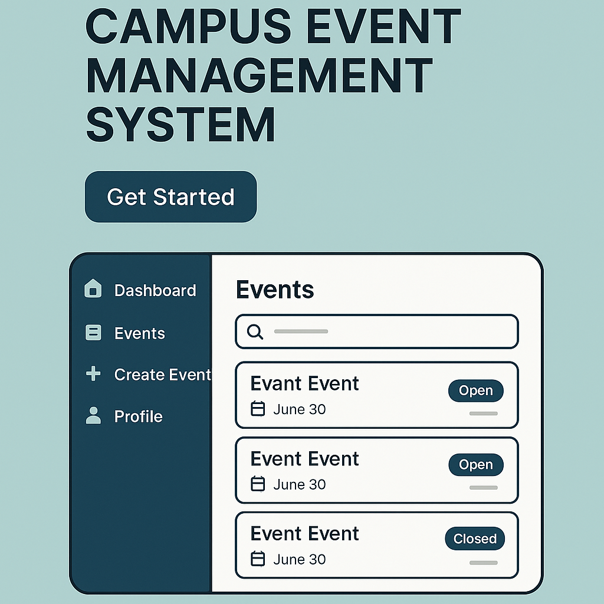

<p align="center">
  
</p>

## <h1 align="center"> Campus Event Management System (CEMS) </h1>

Campus Event Management System (CEMS) is a modern, full-stack **University Event Management System**.  
It empowers students to register for events and enables club admins to create, manage, and monitor events — all in a beautifully designed, mobile-responsive platform.

Built with:

- **Frontend**: HTML, CSS, Bootstrap, JavaScript
- **Backend**: Django (Python)
- **Database**: sqlite3

---

## Key Features

- _Custom Dashboard Navigation_:
  Smart login directs students and club admins to their personalized dashboards.

- _Event Enrollment Made Simple_:
  Students can easily browse and sign up for campus activities of interest.

- _Event Creation Suite for Admins_:
  Club admins can set up new events with comprehensive details like title, description, date, capacity, and visuals.

- _Capacity Management System_:
  Events automatically close registrations when the participant limit is reached.

- _Dynamic Participation Status_:
  Events show live status indicators indicating whether they are "Open" or "Closed."

- _Chronological Event Organization_:
  Events are sorted into upcoming and past categories for easy access.

- _Smart Notifications & Extras_:

• _Registration Confirmation Emails_: Confirms successful sign-ups by sending emails and OTPs.

• _Countdown Timers for Anticipation_: Real-time countdowns to the event start date.

• _Digital Ticketing via QR Codes_: Generates QR codes for event entry.

• _Pre-Event Approval Process_: Requires administrative consent before events are published.

• _User-Friendly Cancellation Option_: Allows students to withdraw from events if necessary.

• _Event Discovery Tools_: Search by event or club names and filter by categories.

• _Responsive Interface Design_: Adaptable layout for optimal viewing on any device.

---

## Tech Stack

```
| Frontend   | Backend    | Database |
|:---------: |:--------:  |:--------:|
| HTML       | Django     | sqlite3  |
| CSS        | Django ORM |          |
| Bootstrap  |            |          |
| JavaScript |            |          |
```

---

## Project Structure

```
Campus Event Management System (CEMS)/
├── CEMS/             # Django Backend (Django + sqlite3) and Frontend(HTML, CSS, JS)
├── README.md         # Project Documentation
```

# Core Pages

- Login Page

- Signup Page

- Event List Page

- Event Details Page

- Create Event Page

- Profile Page (Registered / Created Events)

- Event Categories Expansion

- Admin Dashboard Analytics

- Payment Method (On-going)

- Reminder, Google Calendar Event Sync (On-going)

- AI Assistant (On-going)

---

# Future Enhancements

- Real-time Notifications

---

_Contribution_

We welcome contributions!

Please open issues and submit pull requests with clear, concise commits.

---

# Developed By

Campus Event Management System (CEMS) Development Team

**Md Rakibul Hassan**

Web developer specializing in front-end, back-end, and Django, with additional expertise in IoT and robotics.
🔗 [LinkedIn](https://www.linkedin.com/in/md-rakibul-hassan-507b00308)

**Md Tahsin Azad Shaikat**

Web developer focused on front-end, back-end, and Django, with supplementary skills in IoT and robotics.
🔗 [LinkedIn](https://www.linkedin.com/in/mdtahsinazad020/)

**Dipa Barua**

Frontend Developer | UI/UX Designer
🔗 [LinkedIn](https://www.linkedin.com/in/dipa-barua-387071303/)

---

**License**

This project is licensed under the MIT License.

---

# Project Status

Campus Event Management System (CEMS) is actively under development and growing every day.

Stay tuned for more awesome updates!

---
